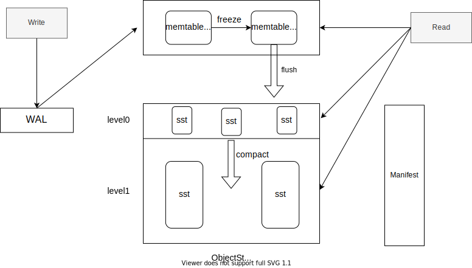

# Storage

The storage engine mainly provides the following two functions：

1. Persistence of data
2. Under the premise of ensuring the correctness of the data, organize the data in the most reasonable way to meet the query needs of different scenarios.

This document will introduce the internal implementation of the storage engine in CeresDB. Readers can refer to the content here to explore how to use CeresDB efficiently.

# Overall structure

CeresDB is a distributed storage system based on the share-nothing architecture.

Data between different servers is isolated from each other and does not affect each other. The storage engine in each stand-alone machine is a variant of [log-structured merge-tree](https://en.wikipedia.org/wiki/Log-structured_merge-tree), which is optimized for time-series scenarios. The following figure shows its core components:

## Write Ahead Log (WAL)

A write request will be written to

1. memtable in memory
2. WAL in durable storage

Since memtable is not persisted to the underlying storage system in real time, so WAL is required to ensure the reliability of the data in memtable.

On the other hand, due to the design of the [distributed architecture](../architecture.md), WAL itself is required to be highly available. Now there are following implementations in CeresDB:

- [Local disk](../wal_on_rocksdb.md) (based on [RocksDB](http://rocksdb.org/), no distributed high availability)
- [OceanBase](https://www.oceanbase.com)
- [Kafka](../wal_on_kafka.md)

## Memtable

Memtable is a memory data structure used to hold recently written table data. Different tables have its corresponding memtable.

Memtable is read-write by default (aka active), and when the write reaches some threshold, it will become read-only and be replaced by a new memtable.

The read-only memtable will be flushed to the underlying storage system in SST format by background thread. After flush is completed, the read-only memtable can be destroyed, and the corresponding data in WAL can also be deleted.

## Sorted String Table（SST）

SST is a persistent format for data, which is stored in the order of primary keys of table. Currently, CeresDB uses parquet format for this.

For CeresDB, SST has an important option: segment_duration, only SST within the same segment can be merged, which is benefical for time-series data. And it is also convenient to eliminate expired data.

In addition to storing the original data, the statistical information of the data will also be stored in the SST to speed up the query, such as the maximum value, the minimum value, etc.

## Compactor

Compactor can merge multiple small SST files into one, which is used to solve the problem of too many small files. In addition, Compactor will also delete expired data and duplicate data during the compaction. In future, compaction maybe add more task, such as downsample.

The current compaction strategy in CeresDB reference Cassandra:

- [SizeTieredCompactionStrategy](https://cassandra.apache.org/doc/latest/cassandra/operating/compaction/stcs.html)
- [TimeWindowCompactionStrategy](https://cassandra.apache.org/doc/latest/cassandra/operating/compaction/twcs.html)

## Manifest

Manifest records metadata of table, SST file, such as: the minimum and maximum timestamps of the data in an SST.

Due to the design of the distributed architecture, the manifest itself is required to be highly available. Now in CeresDB, there are mainly the following implementations：

- WAL
- ObjectStore

## ObjectStore

ObjectStore is place where data (i.e. SST) is persisted.

Generally speaking major cloud vendors should provide corresponding services, such as Alibaba Cloud's OSS and AWS's S3.
